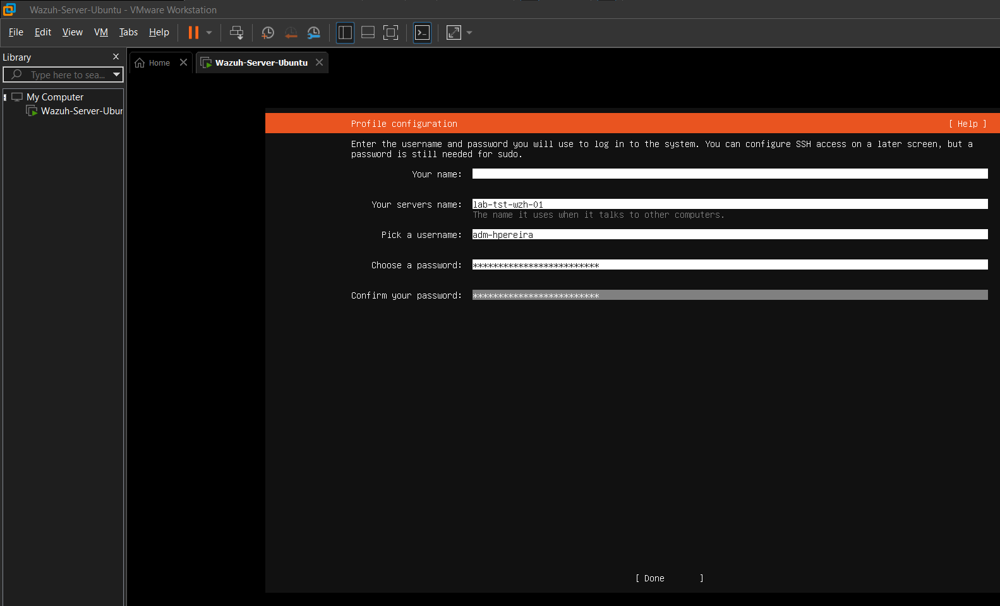
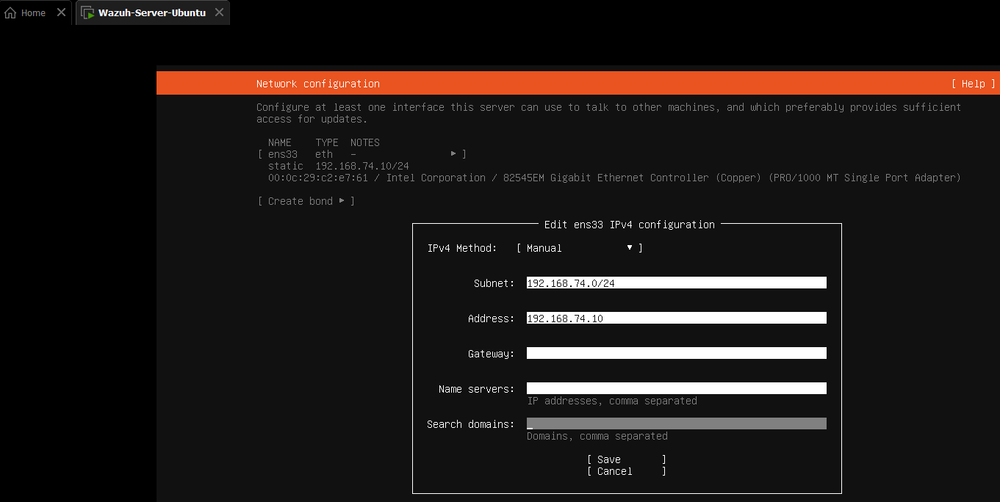
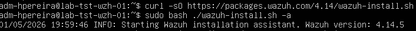
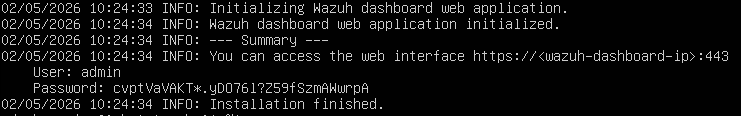
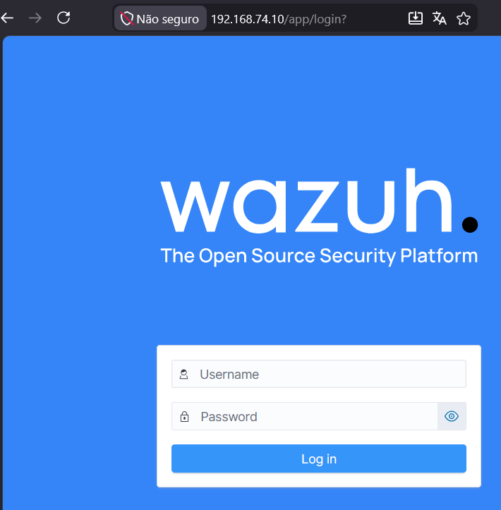
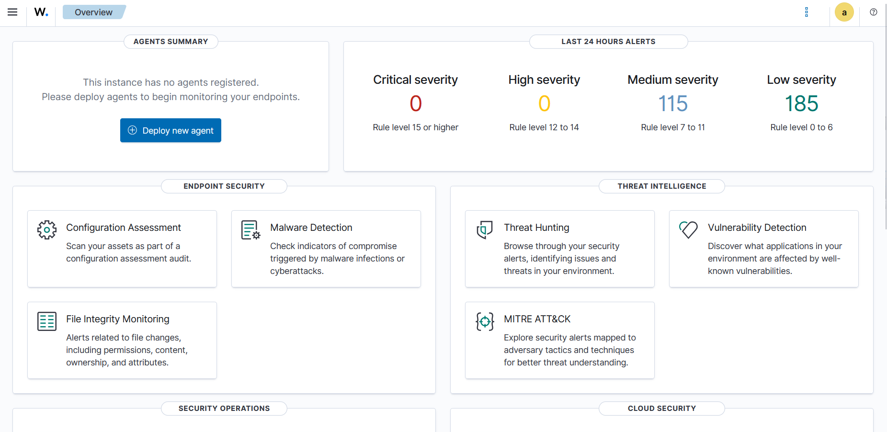

# Project 1: Architecting the Lab & Deploying the SIEM (Wazuh)

**A Quick Introduction:** 
*I want to preface this project by saying that this is a very basic starting point. I built this environment as a hands-on way to learn about Security Operations, network architecture, and log analysis from the ground up. By documenting my process, errors, and design choices, I hope this not only tracks my own progression but also serves as a helpful, practical guide for anyone else starting out in cybersecurity.*

---

## Objective
To design and provision a logically isolated, enterprise-style virtual network, deploy a localized open-source SIEM (Wazuh), and establish a secure administrative foundation for future threat hunting and incident response simulations.

## Design Choices & Enterprise Standards
Before provisioning the hardware, I established foundational standards to mirror a real-world enterprise environment:

*   **Hypervisor Selection:** I utilized VMware Workstation Pro. While proficient in other hypervisors, industry consensus favors VMware for resource allocation in intensive SIEM workloads.
*   **Infrastructure Naming Standards:** Adhering to IT Asset Management (ITAM) best practices, I avoided default/hobbyist hostnames. The SIEM server was designated `LAB-TST-WZH-01` (Lab Environment, Testing Tier, Wazuh Role, Node 01) to ensure scalability.
*   **Authentication & IAM:** Following NIST SP 800-63B Digital Identity Guidelines, I avoided generic privileged accounts (e.g., `admin`, `root`). I created a uniquely identifiable administrative account (`adm-hpereira`) secured by a >15-character passphrase to ensure auditability and mitigate brute-force risks.

---

## Network Architecture
To isolate malicious simulation traffic from my physical home LAN, I configured a custom NAT virtual switch (`VMnet8`). 

*Note on the IP scheme: I utilized the `192.168.74.0/24` subnet. The "74" is simply a personal touch tied to my nickname. If you are following along, you can use any private number (e.g., .50, .100) as long as it doesn't conflict with your physical home router.*

**Lab Network IP Assignments:**
*   **VMware NAT Gateway:** `192.168.74.2`
*   **Wazuh SIEM Server (Ubuntu 22.04 LTS):** `192.168.74.10` *(Listens for endpoint logs on Port 1514)*
*   **Windows 11 Endpoint (Victim):** `192.168.74.20`
*   **Kali Linux (Attacker):** `192.168.74.30`

---

## Methodology

### 1. VM Provisioning
I provisioned the SIEM virtual machine with resources capable of handling high-volume log indexing, dedicating 4 vCPUs, 8GB of RAM, and 50GB of dynamically allocated storage on the custom NAT network.

### 2. OS & Network Configuration
During the Ubuntu Subiquity installation, the GUI failed to properly apply the static IP parameters.

.

 I bypassed the GUI network setup and opted to continue the installation without network access. Once the OS booted, I utilized the command line to manually configure the Linux Netplan YAML file to assign the static IP (`.10`) and route traffic to the NAT Gateway (`.2`).

### 3. SIEM Deployment

After updating the OS repositories, I pulled and executed the official Wazuh All-in-One installation script. 

This automated the deployment of the Wazuh Manager, Indexer, and Dashboard. Once completed, I securely documented the script-generated administrative credentials. 

To verify the deployment, I navigated to the Wazuh Manager's IP address *https://192.168.74.10* via the host machine's web browser.

Upon entering the credentials, I successfully authenticated into the dashboard, confirming the SIEM was online and communicating across the virtual network.

---

## Roadblocks & Troubleshooting

**VMware NAT Gateway Routing Failure**
*   **Issue:** After configuring the static IP in Netplan, the server returned a `Temporary failure in name resolution` error when attempting to ping external domains, indicating a lack of internet connectivity. 
*   **Investigation & Resolution:** I initially set my Netplan default route to `192.168.74.1`. Upon investigation, I discovered that VMware Workstation NAT networks reserve the `.1` address for the host machine's virtual adapter and assign the actual routing gateway to `.2`. I updated the Netplan configuration to route via `192.168.74.2`, applied the changes, and immediately restored DNS resolution and internet connectivity.